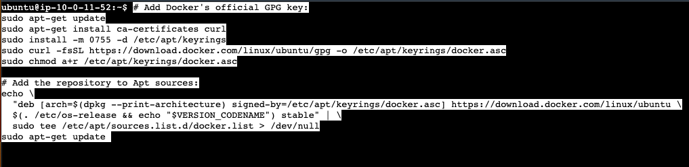
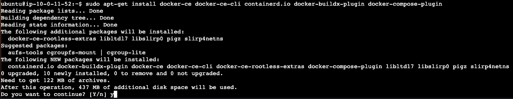
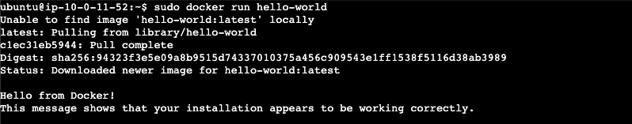
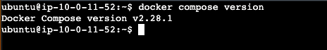

# Docker
This guide will walk you through how to install Docker on the widely supported Ubuntu OS. Installing on Ubuntu will spare you on potential issues during installation and time spent on troubleshooting dependency conflicts from other potentially unsupported systems.


## Update Ubuntu
With the following commands:<br>
`sudo apt update`<br>
`sudo apt upgrade`


## Uninstall Packages
This installation will also install some dependencies as one bundle: `containerd.io`.<br>
Because of this, already having these dependencies installed will conflict with a fresh install.<br>
Remove them with:<br>
`for pkg in docker.io docker-doc docker-compose docker-compose-v2 podman-docker containerd runc; do sudo apt-get remove $pkg; done`

Note: the output might report that 0 dependencies were removed, because you might not have them. But it's still good to run the command to be sure.


# Docker Engine

## Install Docker repository
First, you'll need to set up Docker's repository by copy/pasting the following block of commands:

```
# Add Docker's official GPG key:
sudo apt-get update
sudo apt-get install ca-certificates curl
sudo install -m 0755 -d /etc/apt/keyrings
sudo curl -fsSL https://download.docker.com/linux/ubuntu/gpg -o /etc/apt/keyrings/docker.asc
sudo chmod a+r /etc/apt/keyrings/docker.asc

# Add the repository to Apt sources:
echo \
  "deb [arch=$(dpkg --print-architecture) signed-by=/etc/apt/keyrings/docker.asc] https://download.docker.com/linux/ubuntu \
  $(. /etc/os-release && echo "$VERSION_CODENAME") stable" | \
  sudo tee /etc/apt/sources.list.d/docker.list > /dev/null
sudo apt-get update
```



These commands will: 
1. update the local package list with information about new packages 
2. install `curl` as well as the `ca-certificates` bundle of trusted Certificate Authorities
3. install create the directory `/etc/apt/keyrings` if it doesn't exist, and set permissions
4. use `curl` to download the GPG key file from `https://download.docker.com/linux/ubuntu` into the file in `/etc/apt/keyrings/docker.asc`
5. set the `/etc/apt/keyrings/docker.asc` GPG key file permissions

6. in short, this long command creates a file that tells `apt` package manager where to find the latest Docker software for your specific version of Ubuntu, and use a special GPG key to verify that the downloaded Docker software is genuine and untampered.


## Install Docker packages
Install with the following command:<br>
`sudo apt-get install docker-ce docker-ce-cli containerd.io docker-buildx-plugin docker-compose-plugin`

Confirm the install at the following prompt with:<br>
`y`




## Start Docker
Start with the following command:<br>
`sudo systemctl start docker`

Verify proper Docker installation by accessing an image on Docker Hub:<br>
`sudo docker run hello-world`




# Docker Compose
This makes managing your applications that implement Docker a little easier. 
You can just create one generic YAML file that will grab the specific containers and services that you need, and spin them up correctly so that they can communicate with each other.

You will be spinning up a few different containers, and those containers are taking advantage of services from other containers. For example, the front-end and back-end will be taking advantage of an OpenSearch container that will be running the OpenSearch service within it. So it needs to be able to not only install OpenSearch and get that up and running, but it also needs to communicate with it.

Furthermore, this YAML file allows a defined environment to be reproducible amongst different instances. Organizations can use this image to create a baseline configuration to define every new instance.

**Docker Compose** is a tool used with Docker to seamlessly describe configurations within a single YAML file for multi-container applications. It allows you to define your application’s services, network, and other settings in `docker-compose.yml` file. You can then run that file with the simple `docker compose up -d` command, as opposed to using CLI options as you do with Docker.

## Install Docker Compose plugin
The Docker repository has already been set up.<br>
So update the package index, and install Docker Compose with:
```
sudo apt-get update
sudo apt-get install docker-compose-plugin
```

Verify installation with:<br>
`docker compose version`




## How does Docker work?
If you're anything like me, you might feel overwhelmed when reading documentation about new technologies, since I find that documentation for open-source tools usually aren't very user-friendly. So let's talk about how Docker works. 

### Docker Registry
The Docker Registry is a repository that's used to store and retrieve (push and pull) Docker images. It handles image distribution through the use of **Docker Registry HTTP API v2**. There's 3 types of registries here: Public, Private, and Third-Party.

`docker pull nginx:latest` pulls an image from Docker Hub.
`docker push myregistry.com:5000/myapp:v1` pushes your custom image to Docker Hub.

**Docker Hub** is a specific implementation of the registry, that's provided by Docker as a free service.

## What happens under-the-hood?
Docker checks if the image exists locally, and if it doesn’t, it pulls it from the registry.
It creates writable container layers on top of the image layers. 

A Docker image is like a read-only template to build the container. The container is built from this blueprint. This blueprint is called an **image**. This image remains unchanged, which is why it’s considered the ground layer which the container layer is built on. However, the container layer you can write changes to. 

### Image Layer
This layer is itself comprised of different layers. Each layer represents a set of file changes:
* Layer 1:  add the base OS (like Ubuntu)
* Layer 2:  run `apt install python3`
* Layer 3:  copy your application code: `COPY . /app`

### Container Layer
When you start a container from an image, Docker adds a writable layer on top of the stack of image layers. When you make changes to a running container (creating, modifying or deleting files), it’s only written to this layer. When the Docker container is destroyed (like when you shut it down or turn off the computer) any changes that are made here are persisted through us of the **Docker Volumes**, and are seamlessly loaded back up the next time you run a new container. 

Docker leverages Linux kernel features and primitives (like namespaces and cgroups) insted of emulating hardware (the way virtual Machines do). This is why Docker containers are dramatically faster than VMs.

### Under-the-hood
Now let’s get back to what happens when you create a container with `docker run`:
* Docker checks if the image exists locally
    - If it’s found, it uses it
    - If it isn’t found, it pulls the image from a registry
    - Each of these read-only layers are verified and stored in Docker’s storage directory
* Docker creates the writable Container Layer
    - Sets up the Union Filesystem mount
* Docker initializes the Filesystem
    - it mounts the layered filesystem under the container layer
    - it sets up any specified volumes
    - it configures tmpfs mounts, if specified
* Docker sets up the network
    - it creates a network namespace for the container. A network namespace is a Linux kernel feature that provides complete isolation of the network stack. It’s like a virtual network environment with it’s own network interfaces, ip addresses, routing table, firewall rules, port numbers and sockets, DNS resolvers and hosts file.
    - It creates a virtual ethernet pair  called `veth`. One end of the `veth` pair is placed in the container’s namespace (usually `eth0`). The other end is placed on the Docker host’s network namespace. 
    - It then bridges the connection by connecting the host end of the `veth` pair to the Docker bridge (`docker0` by default). This bridge acts as a virtual switch connecting all containers. This Docker bridge is how containers would communicate with each other.
    - It assigns an IP address from the subnet, which is typically a 172.17.0.0/16 network. The default gateway will be 172.17.0.1.
    - It configures routing and DNS.
* Docker creates container ID and name, allocates resources (CPU, RAM, etc), and validates CLI options.
* Docker starts the main process (CMD/ENTRYPOINT from Dockerfile)
* Docker connects STDIN, STDOUT, STDERR to your terminal. 
* Docker configures and starts some security features, such as SELinux and Apparmor.
* Docker provides some runtime monitoring features, such as containerd which monitors it’s processes, and some log drivers which process logs.

Remember that the processes mentioned above are a combination of the container being created AND starting up, which is what happens when you use `docker run`.