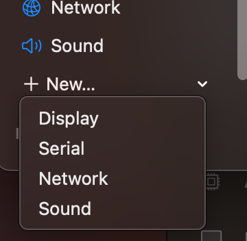

# Kali Linux
First, download the Kali iso file from the following page:<br>
https://www.kali.org/get-kali/#kali-installer-images

Scroll down to the first download option the reads: 
```
Installer 
Complete offline installation with customization
```
...BUT before you download, click on the white tab above that reads `Apple Silicon (ARM64)`.
With the ARM image selected, click on the recommended `Installer` card in the center.


## Create empty VM shell
I believe a storage size of 26GB is a well-balanced size to not use up too much of the host storage, and should not give much issues down the line when installing some new software, collecting logs, or updating. 
In order to save headaches from the installer crashing, give it 3 cores (just for now) and 4GB of RAM (memory).

Follow the same instructions as the [Ubuntu](./Ubuntu.md) instance to create your empty virtual machine, except you'll be loading the Kali iso file instead of Ubuntu iso.

Before we begin the installation, go into settings. Right click on the VM in left panel, and click the **Edit** button. 

Click on the **+ New** button in the left panel, and click on **Serial**. <br>
 <br>

This will give us a second (and less buggy) terminal window, which you can view in the newly created **Serial** tab. This will mimic an external monitor, plugged into an old serial port.<br>
Click **Save**.<br>

Also, click on the **+ New** button in the left panel one more time, and click on **Network**. <br>
Click on the `Automatic` selection, and change it to your physical router's main network interface (might be eth0 or enp0s1).

Click the **Play** button, either on the left panel on the selected VM, or on the right panel in the center of large window. 


## Installing Kali
### Language options
Select English and press `Enter`.<br>
Select your country and press `Enter`.<br>
Select your keymap and press `Enter`<br>

### Network configuration
The system will attempt to configure its own network. 

### Credentials configuration
It will then stop at a screen to select your VM's hostname. I named mine as `Kali`. Click `Enter`.<br>
You can leave your hostname as blank for now, or choose a domain name now. Your choice. Click `Enter`.<br>
On the next screen, write your first name. Press `Enter`.<br>
This screen is important, type your username. This will be your main login. Press `Enter`.<br>
Choose your password. Press `Enter`.<br>
Confirm that same password, and press `Enter`.<br>
Select your timezone. Press `Enter`.

### Storage configuration
Unless you'd like to use LVM (Ubuntu's default storage setup) or encrypt your entire volume, choose the initial option at the top:<br>
`Guided - use entire disk`<br>
Press `Enter`.<br>
Confirm the initial selection to select your VM's block device. Press `Enter`.<br>
Unless you have a desired partition scheme, select the first option for one large partition. Press `Enter`.<br>
Select `Finish partitioning and write changes to disk`. Press `Enter`.<br>
It asks you to confirm changes to disks. Select `Yes` and press `Enter`.<br>
The system will begin formatting your partition/s.

### GUI Selection
This next part is pretty important, as it will determine your GUI (Graphical User Interface). This determines how you interact with your system. In order to follow this guide in areas that don't utilize the terminal, you'll want to go with the default option of `XFCE`. This is Kali Desktop's default interface, whereas GNOME is Ubuntu Desktop's default interface.<br>
Press `Enter`.

