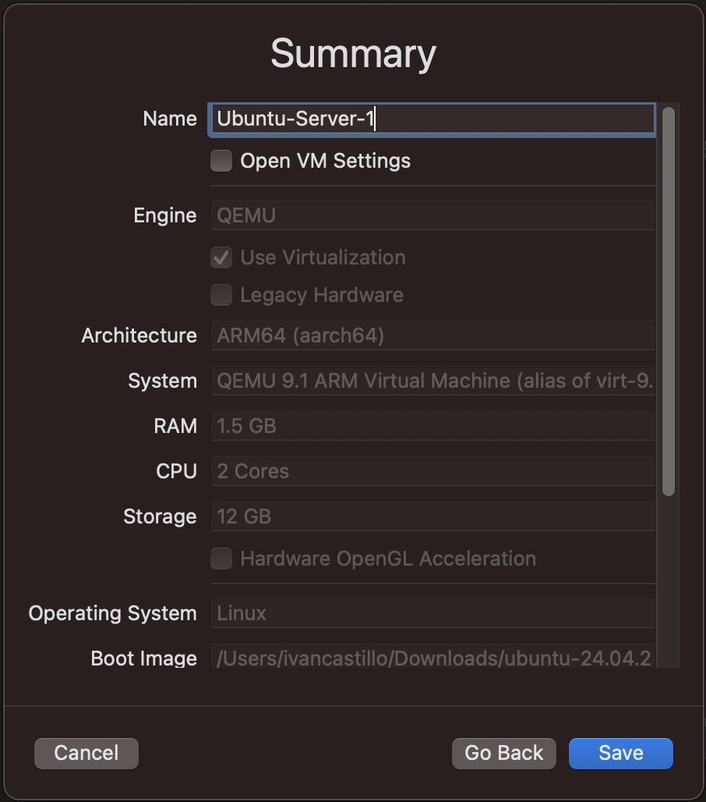
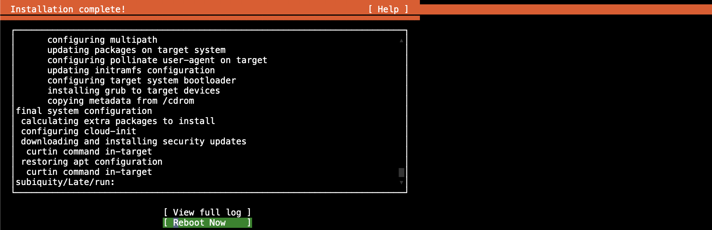

# Ubuntu

## Creating empty virtual machine
In the main UTM dashboard, click on **Create a new virtual machine**. 

Click on **Virtualize** button. 

Click on **Linux** button. 

Click on **Browse** button to select the previously downloaded Ubuntu iso image that gets executed for the installation on the first time the virtual machine is run. 

Select the Ubuntu iso from the directory (most likely your Downloads folder), and click **Open** button. 

You should now see your Ubuntu iso file selected in the **Boot ISO Image** section of the **Virtualization Engine** window. 

Select how much RAM memory and how many cores you need. I normally go with 1.5 MB of RAM, and 1 or 2 cores. This can easily be changed in the future, so there's no need to aim higher unless you're running hardware intensive software on your server.  
Click **Continue** button. 
  

The storage is much more difficult to change, so for this selection you might want to aim for how much space you think your applications will need. But for server applications, I believe that 12 GB should be enough. 
Click **Continue**. 
  

No need to fidget with the **Shared Directory** option unless you have a specific use case. Click **Continue** button. 

In the **Summary** window, label the name you'd like for your Virtual Machine. Click **Save** button. 
  

Your empty virtual machine should now be ready for the first boot Ubuntu installation.  
With your newly created VM selected on the left panel, scroll down on the right UTM panel. At the very bottom, you should be able to read that the our virtual machine is going to virtualize a CD/DVD drive, with the Ubuntu iso file selected. It's like mimicking a real computer with a CD drive, and an old Operating System CD inside of the drive! 

Before we begin the installation, go into settings. Right click on the VM in left panel, and click the **Edit** button. 
  

Click on the **+ New** button in the left panel, and click on **Serial**.  
  

This will give us a second (and less buggy) terminal window, which you can view in the newly created **Serial** tab. This will mimic an external monitor, plugged into an old serial port. 
Click **Save**. 

  

Click the **Play** button, either on the left panel on the selected VM, or on the right panel in the center of large window. 

## Installing Ubuntu operating system
When the installation iso boots, we are shown two different windows. Keep the window that reads `(Terminal 1)` after the name that you previously labelled your VM. This is our less buggy **Serial** terminal. Minimize the other window. 
  

**NOTE:** in this terminal, the only navigation you'll need should be done with the `Enter`, `Arrow` keys, and on occasion the `Tab` button.

Select `Continue in rich mode` and press `Enter`.

Select your language and press `Enter`.
  

If there is an update to the installer, you probably won't need it. Press `Enter`.
  

Choose the keyboard layout only if different. Then highlight **Done** and press `Enter`.
  

For this section, I usually choose `Ubuntu Server (minimized)` to save as much space as I can for my use case. If I need any of the extra default software, I can just download them later. But if you feel comfortable that you've allocated enough space in your VM's hard drive for the extra bells n' whistles, then feel free to try out the standard version of Ubuntu Server.  
When you're ready, select **Done** and press `Enter`.
  

The default network configuration should be good enough. If you'd like to configure your own go ahead. But this can always be changed later.  
Select **Done** and press `Enter`.
  

Like the last window, the proxy configuration can be changed later. Press `Enter`.

The Ubuntu archive mirror configuration shouldn't take long, and it might not matter. Press `Enter`.

In the storage configuration, the default options have always been fine for me. You'll want as much space as you can get for your own use on the virtual machine, so be sure to select **Use an entire disk**. Toggle to the bottom with the `arrow` keys or `Tab` button, select **Done** and press `Enter`. 
  

The next window is just a review of storage configuration. Select **Done** and press `Enter`. 
  

The next window is just warning about the destruction of data from the formatting of disk drives. But because this is an empty VM, there is no data to begin with. Select **Continue** and press `Enter`. 
  

Enter your settings for name, server name, username, and password. When you're finished, select **Done** and press `Enter`. 
  

No need to update to Ubuntu Pro. Press `Enter`.

The SSH configuration can be changed later. I usually just use SSH protocol between servers, so I haven't had need for OpenSSH server. Install if you prefer. When finished, select **Done** and press `Enter`. 
  

Select any snaps that you'd like. Like any other software, I usually install as needed later. When finished, select **Done** and press `Enter`. 
  

Finally, you can sit back and relax for a few while the installation happens.  
  

When installation is complete, select **Reboot Now** and press `Enter`. 
  

You'll be stopped with a message that lets you know that you'll need to remove the installation CD. Minimize the terminal window. You'll need to go back into the main UTM window and virtually eject the Ubuntu iso file from the CD/DVD drive by clicking on it and clicking on `Clear`.  
  

Go back to the serial terminal window and accept the reboot again. 

After the usual boot processes, you should see the login prompts.
Enter your username and password. 
  

On first start-up, you'll want to run the Debian update and upgrade. 
  

Congrats! You've just created and installed your Ubuntu Virtual Machine.

## Installing important software

### Networking tools
sudo apt install iputils-ping

sudo apt install traceroute

sudo apt install net-tools 
(ifconfig, netstat)

sudo apt install dnsutils

sudo apt install nmap

### Basic utilities
sudo apt install nano

sudo apt install man-db

sudo apt install curl

sudo apt install wget

